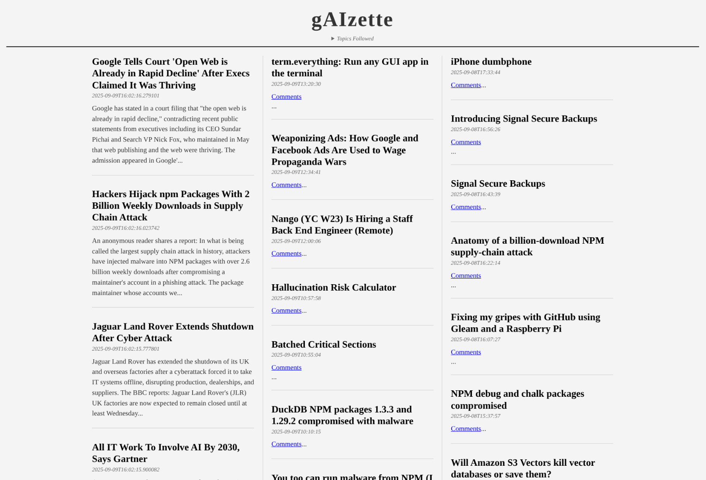

# 



AI powered RSS reader.

## Installation

Use **venv**!

Install dependencies:
```pip install feedparser requests```

Pull gemma3 or other model:
```ollama pull gemma3:12b```

## Configuration

Edit ```feeds.txt``` for RSS sources.
Edit ```topics.txt``` for topics that interests you.

## Running

Make sure ollama is running in the background or run: ```ollama serve```

Run rss reader:

```python rss_reader.py```

Example output:

```
============================================================
🚀 gAIzette RSS Reader - Starting...
============================================================

📋 Loading configuration...
   ✓ Loaded 5 RSS feeds
   ✓ Loaded 3 topics: AI, Technology, Science
   ✓ Using Ollama model: gemma3:12b

🔄 Processing RSS feeds...

   [1/5] Processing: https://techcrunch.com/feed/
       Source: TechCrunch
       Found 20 entries
       ✓ Filtered 8 relevant articles from 20 total

   [2/5] Processing: https://arstechnica.com/feed/
       Source: Ars Technica
       Found 15 entries
       ✓ Filtered 5 relevant articles from 15 total

📊 Summary:
   Total articles analyzed: 75
   Articles matching topics: 28

🔤 Sorting articles by date...
   ✓ Articles sorted (newest first)

📰 Selecting featured stories with AI...
   Analyzing 20 articles for newsworthiness...
   ✓ AI selected 4 featured stories

⭐ Featured stories selected:
   1. Major AI Breakthrough Announced by OpenAI...
   2. Apple Unveils Revolutionary New Technology...
   3. Scientists Discover New Method for Quantum...
   4. Breaking: Major Security Vulnerability Found...

🎨 Generating HTML...
   Writing HTML to file...

============================================================
✅ SUCCESS!
============================================================
📄 Generated 'news.html' with:
   • 4 featured stories
   • 24 regular articles
   • 28 total articles

🌐 Open 'news.html' in your browser to view your personalized news!
============================================================
```


